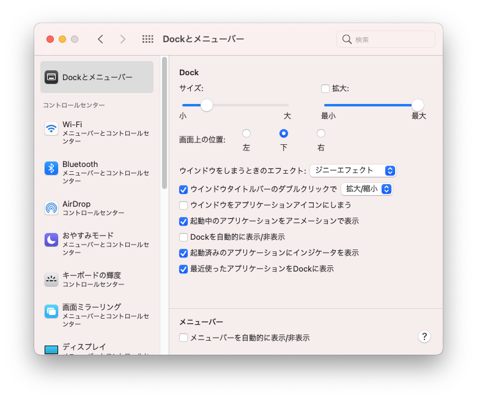

# OSバージョン

```
$ sw_vers

ProductName:    macOS
ProductVersion: 11.4
BuildVersion:   20F71
```

# Summary

1. [Dockとメニューバー](#dockとメニューバー)
1. [トラックパッド](#トラックパッド)
1. [キーボード](#キーボード)

## Dockとメニューバー



## トラックパッド

## キーボード
